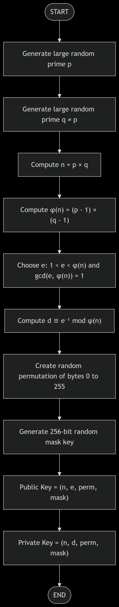
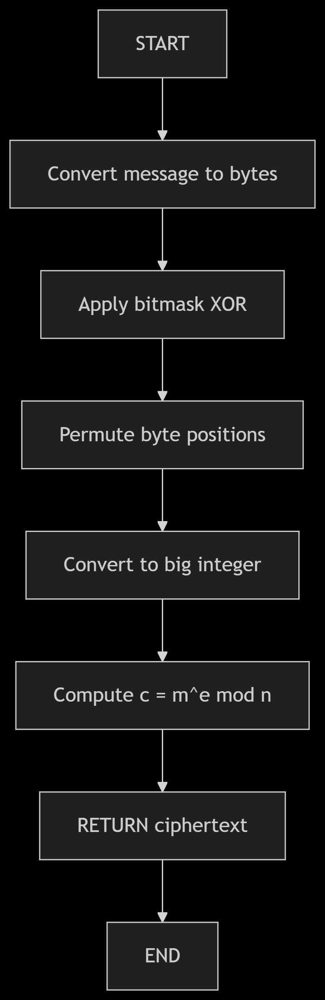
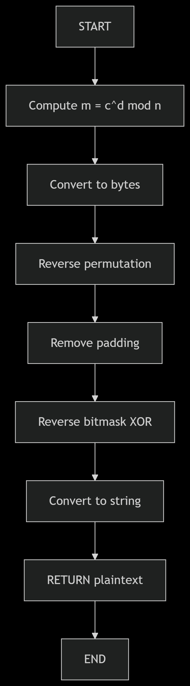

<p align="center">
  
</p>
<h1 align="center">
  <b>Encryption Algorithm</b>
</h1>
<h3 align="center">
  <br>
  <b>Level-3 Semester-II</b>  
</h3>
<h3 align="center">
  Course Code: CSE 361 
</h3>

<h3 align="center">
  Course Title: Mathematical Analysis for Computer Science
  
</h3>
<br>
<h3 align="center">
  Submitted by 
</h3>
<h3 align="center">
<b>Md. Sabbir Ahamed Shovon (ID: 2102034) </b> </h3>
<br>

<h3 align="center">
  Submitted To 
</h3>

<h3 align="center"><b>Pankaj Bhowmik  </b></h3>
<h3 align="center"><b>Lecturer, Department of CSE</b></h3>
<br>
<h3 align="center"> <b>Department of Computer Science and Engineering </b></h3>
<h3 align="center"><b>Hajee Mohammad Danesh Science and Technology University  
Dinajpur-5200</b></h3>


<h1>Modified RSA Algorithm</h1>

<h2>Algorithm Overview</h2>
<p>This encryption algorithm combines:</p>
<ul>
  <li>GCD and co-prime numbers for key generation</li>
  <li>Bit masking for initial data transformation</li>
  <li>Permutation for position scrambling</li>
  <li>Euler's totient function for RSA-style encryption</li>
  <li>Chinese Remainder Theorem for decryption optimization</li>
</ul>


## Flow Charts

### Key Generation
<ol>
  <li>
    Select two large co-prime numbers <b>p</b> and <b>q</b>
    <ul>
      <li>Generate random numbers in a specified range</li>
      <li>Ensure gcd(p, q) = 1</li>
    </ul>
  </li>
  <li>
    Compute modulus <b>n</b> and Euler's totient &phi;(n)
    <ul>
      <li>n = p &times; q</li>
      <li>&phi;(n) = (p - 1) &times; (q - 1)</li>
    </ul>
  </li>
  <li>
    Choose public exponent <b>e</b>
    <ul>
      <li>Select e where 1 &lt; e &lt; &phi;(n) and gcd(e, &phi;(n)) = 1</li>
    </ul>
  </li>
  <li>
    Compute private exponent <b>d</b>
    <ul>
      <li>d = e<sup>-1</sup> mod &phi;(n) (modular inverse)</li>
    </ul>
  </li>
  <li>
    Generate permutation key
    <ul>
      <li>Create a random shuffle of byte positions (0–255)</li>
    </ul>
  </li>
  <li>
    Generate bitmask key
    <ul>
      <li>Create a random 256-bit mask</li>
    </ul>
  </li>
</ol>
<p align = "center">
 
</p>

### Encryption
<ol>
  <li>Convert message to bytes</li>
  <li>Apply bitmask using XOR operation</li>
  <li>Permute byte positions</li>
  <li>Convert to big integer</li>
  <li>Encrypt using modular exponentiation:<br>c ≡ m<sup>e</sup> mod n</li>
</ol>

<p align = "center">
 
</p>
 <h2>Decryption</h2>
<ol>
  <li>Decrypt using modular exponentiation:<br>m ≡ c<sup>d</sup> mod n</li>
  <li>Convert back to bytes</li>
  <li>Reverse permutation</li>
  <li>Remove padding</li>
  <li>Reverse bitmask</li>
  <li>Convert to original message</li>
</ol>

 <div align = "center" > </div>


```cpp
#include <bits/stdc++.h>
#include <openssl/bn.h>

using namespace std;


vector<uint8_t> string_to_bytes(const string& str) {
    return vector<uint8_t>(str.begin(), str.end());
}

string bytes_to_string(const vector<uint8_t>& bytes) {
    return string(bytes.begin(), bytes.end());
}

vector<uint8_t> int_to_bytes(const BIGNUM* num) {
    int size = BN_num_bytes(num);
    vector<uint8_t> bytes(size);
    BN_bn2bin(num, bytes.data());
    return bytes;
}

BIGNUM* bytes_to_int(const vector<uint8_t>& bytes) {
    BIGNUM* num = BN_new();
    BN_bin2bn(bytes.data(), bytes.size(), num);
    return num;
}

// Key Generate hobe
struct KeyPair {
    BIGNUM* n;
    BIGNUM* e;
    BIGNUM* d;
    vector<uint8_t> perm_key;
    vector<uint8_t> mask_key;
};

BIGNUM* generate_coprime(const BIGNUM* min, const BIGNUM* max, BN_CTX* ctx) {
    BIGNUM* num = BN_new();
    BIGNUM* gcd = BN_new();
    BIGNUM* one = BN_new();
    BN_one(one);

    do {
        BN_rand_range(num, max);
        if (BN_cmp(num, min) < 0) {
            BN_add(num, num, min);
        }
        BN_gcd(gcd, num, max, ctx);
    } while (BN_cmp(gcd, one) != 0);

    BN_free(gcd);
    BN_free(one);
    return num;
}

KeyPair generate_keys(BN_CTX* ctx) {
    KeyPair keys;
    BIGNUM* p = BN_new();
    BIGNUM* q = BN_new();
    BIGNUM* n = BN_new();
    BIGNUM* phi = BN_new();
    BIGNUM* e = BN_new();
    BIGNUM* d = BN_new();
    BIGNUM* p_minus_1 = BN_new();
    BIGNUM* q_minus_1 = BN_new();
    BIGNUM* max = BN_new();

    BN_set_word(max, 1);
    BN_lshift(max, max, 32);
    BIGNUM* min = BN_new();
    BN_set_word(min, 1);
    BN_lshift(min, min, 16);

    p = generate_coprime(min, max, ctx);
    do {
        q = generate_coprime(min, max, ctx);
    } while (BN_cmp(p, q) == 0);


    BN_mul(n, p, q, ctx);


    BN_sub(p_minus_1, p, BN_value_one());
    BN_sub(q_minus_1, q, BN_value_one());
    BN_mul(phi, p_minus_1, q_minus_1, ctx);


    BN_set_word(e, 65537); // Common choice for e

    
    BN_mod_inverse(d, e, phi, ctx);


    keys.perm_key.resize(256);
    iota(keys.perm_key.begin(), keys.perm_key.end(), 0);
    random_shuffle(keys.perm_key.begin(), keys.perm_key.end());

    
    keys.mask_key.resize(32); // 256 bits
    random_device rd;
    for (auto& byte : keys.mask_key) {
        byte = rd() % 256;
    }

    keys.n = n;
    keys.e = e;
    keys.d = d;

    
    BN_free(p);
    BN_free(q);
    BN_free(phi);
    BN_free(p_minus_1);
    BN_free(q_minus_1);
    BN_free(max);
    BN_free(min);

    return keys;
}

// Encryption functions
vector<uint8_t> apply_bitmask(const vector<uint8_t>& data, const vector<uint8_t>& mask) {
    vector<uint8_t> result(data.size());
    for (size_t i = 0; i < data.size(); i++) {
        result[i] = data[i] ^ mask[i % mask.size()];
    }
    return result;
}

vector<uint8_t> apply_permutation(const vector<uint8_t>& data, const vector<uint8_t>& perm_key) {
    // Pad data to multiple of 256 bytes
    size_t pad_len = (256 - data.size() % 256) % 256;
    vector<uint8_t> padded = data;
    padded.insert(padded.end(), pad_len, pad_len);

    vector<uint8_t> result(padded.size());
    for (size_t block = 0; block < padded.size() / 256; block++) {
        for (size_t i = 0; i < 256; i++) {
            result[block * 256 + i] = padded[block * 256 + perm_key[i]];
        }
    }
    return result;
}

BIGNUM* encrypt(const string& message, const KeyPair& public_key, BN_CTX* ctx) {
    
    vector<uint8_t> bytes = string_to_bytes(message);


    vector<uint8_t> masked = apply_bitmask(bytes, public_key.mask_key);

    vector<uint8_t> permuted = apply_permutation(masked, public_key.perm_key);

    BIGNUM* m = bytes_to_int(permuted);

    BIGNUM* c = BN_new();
    BN_mod_exp(c, m, public_key.e, public_key.n, ctx);

    BN_free(m);
    return c;
}

// Decryption functions
vector<uint8_t> reverse_permutation(const vector<uint8_t>& data, const vector<uint8_t>& perm_key) {
    // Create inverse permutation
    vector<uint8_t> inv_perm(256);
    for (size_t i = 0; i < 256; i++) {
        inv_perm[perm_key[i]] = i;
    }

    vector<uint8_t> result(data.size());
    for (size_t block = 0; block < data.size() / 256; block++) {
        for (size_t i = 0; i < 256; i++) {
            result[block * 256 + i] = data[block * 256 + inv_perm[i]];
        }
    }
    return result;
}

string decrypt(const BIGNUM* ciphertext, const KeyPair& private_key, BN_CTX* ctx) {
  
    BIGNUM* m = BN_new();
    BN_mod_exp(m, ciphertext, private_key.d, private_key.n, ctx);


    vector<uint8_t> bytes = int_to_bytes(m);

    
    vector<uint8_t> unpermuted = reverse_permutation(bytes, private_key.perm_key); 
    size_t pad_len = unpermuted.back();
    unpermuted.resize(unpermuted.size() - pad_len);
    vector<uint8_t> unmasked = apply_bitmask(unpermuted, private_key.mask_key);
    string result = bytes_to_string(unmasked);

    BN_free(m);
    return result;
}

```
 
 


